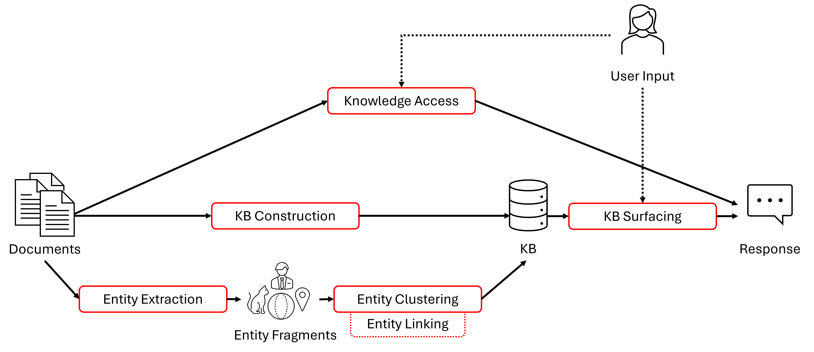

# Knowledge Base Construction and Access Benchmark (KeBAB)


This repository contains the backend implementation for the **K**nowledg**e** **B**ase construction and **A**ccess **B**enchmark (KeBAB🍢).

The recommended way to install the code is to clone the repository and install the package in editable mode:

```bash
pip install -e .[all]
```

The recommended way to have the data available on a Windows dev machine:
1. Navigate to the "Documents\Benchmark" page in the Project Alexandria SharePoint.
2. Click "Add shortcut to OneDrive" to create a shortcut to this directory in your own OneDrive.
3. In your local OneDrive folder (usually `%USERPROFILE%/OneDrive - Microsoft`), assuming it is synced, you will find the `Benchmark` folder.
4. Create a shortcut to the `Benchmark` folder and place it in the root of this repository.

You can run `test_benchmark_tasks_config` manually to verify that the data is available in the expected location.

The recommended way to have the data available on a Linux VM:
1. First, have the data available locally on your Windows machine as described above.
2. On the VM, create a directory called `Benchmark` in the root of this repository.
3. Use `rsync` to copy the data from your Windows machine to the VM:
   ```bash
   rsync -rz -e ssh --ignore-existing --progress --stats ./Benchmark/ <vm>:/path/to/your/repo/Benchmark/
   ```

## Overview

Our goal is to enable benchmarking of:
- Different approaches for knowledge access (e.g., text-retrieval-augmentation vs. KB-augmentation),
- Different approaches for surfacing knowledge from KBs, and
- Different approaches for KB construction,
- Different approaches for individual steps in KB construction (e.g., for entity extraction and clustering)

Our current focus is on building a shared internal benchmark to encourage and facilitate cross-group collaborations across Microsoft.
Eventually, we would like to publicly release the benchmark and build research communities around these shared tasks.


## Glossary

- **Entity:** A set of properties with provenance information.
- **Entity fragment:** A partial entity extracted from a single piece of text.
- **Knowledge base (KB):** A set of entities.


## Tasks

The benchmark will support several related **tasks** depicted by red rectangles in the figure below.
For each task, the benchmark may provide multiple benchmarking datasets and corresponding evaluation metrics, each of which we refer to as a **task instance**.
For example, the KB construction task may have one instance that benchmarks based on a corpus of emails and another based on a corpus of scholarly articles.
We define consistent interfaces for each task that all corresponding task instances will comply with.
This is to ensure that any given model for a task can be easily run on all corresponding task instances without requiring instance-specific code changes.
We describe the supported tasks and task instances below.



### Knowledge access task
**Input:** A text corpus + a user input.  
**Expected output:** A generated response.  
**Task instance(s):** Currently, one task instance comprising of document completion given initial few tokens of the document.

### KB surfacing task
**Input instance:** A KB + a user input.  
**Expected output:** A generated response.  
**Task instance(s):** Currently, one task instance comprising of document completion given initial few tokens of the document.

### KB construction task
**Input:** A text corpus.  
**Expected output:** A KB.  
**Task instance(s):** We have not implemented any instances for this task yet.

### Entity extraction task
**Input instance:** Text.  
**Expected output instance:** A set of entity fragments.  
**Task instance(s):** Currently, one task instance based on [ReDocRed](https://github.com/tonytan48/Re-DocRED).

### Entity linking task
**Input instance:** A pair of entity fragments.  
**Expected output instance:** Boolean prediction on whether they correspond to the same entity or not.  
**Task instance(s):** Currently, one task instance based on [REBEL](https://github.com/Babelscape/rebel).

### Clustering task
**Input:** A set of entity fragments.  
**Expected output:** A KB.  
**Task instance(s):** Currently, one task instance based on [REBEL](https://github.com/Babelscape/rebel).


## Repository organization

The repository is organized to ensure clarity and ease of navigation. Below is a brief overview of the main directories and their purposes:

* build/: Contains configuration files for automated builds.
* docs/: Documentation resources, including experiment results.
* kebab/: Contains the core implementation of the project, including all modules, utilities, and primary logic. 
    * configs/: Configuration files for the benchmark.
    * contracts/: Core interfaces and abstractions that define the project's key contracts and APIs for document, entity, task, etc.
    * tasks/: Task-specific implementations for various task types, such as extraction, linking, and more.
    * utils/: Utility functions for common operations across the project, including I/O handling, logging, and data processing.
    * mskebab.py: Contains the entry point class `Benchmark`.
* scripts/: Includes scripts for specific tasks such as data downloading, processing, or running experiments.
* tests/: Contains tests to ensure the robustness and reliability of the codebase.


## Contributing

This project welcomes contributions and suggestions.  Most contributions require you to agree to a
Contributor License Agreement (CLA) declaring that you have the right to, and actually do, grant us
the rights to use your contribution. For details, visit https://cla.opensource.microsoft.com.

When you submit a pull request, a CLA bot will automatically determine whether you need to provide
a CLA and decorate the PR appropriately (e.g., status check, comment). Simply follow the instructions
provided by the bot. You will only need to do this once across all repos using our CLA.

This project has adopted the [Microsoft Open Source Code of Conduct](https://opensource.microsoft.com/codeofconduct/).
For more information see the [Code of Conduct FAQ](https://opensource.microsoft.com/codeofconduct/faq/) or
contact [opencode@microsoft.com](mailto:opencode@microsoft.com) with any additional questions or comments.


## Trademarks

This project may contain trademarks or logos for projects, products, or services. Authorized use of Microsoft 
trademarks or logos is subject to and must follow 
[Microsoft's Trademark & Brand Guidelines](https://www.microsoft.com/en-us/legal/intellectualproperty/trademarks/usage/general).
Use of Microsoft trademarks or logos in modified versions of this project must not cause confusion or imply Microsoft sponsorship.
Any use of third-party trademarks or logos are subject to those third-party's policies.
