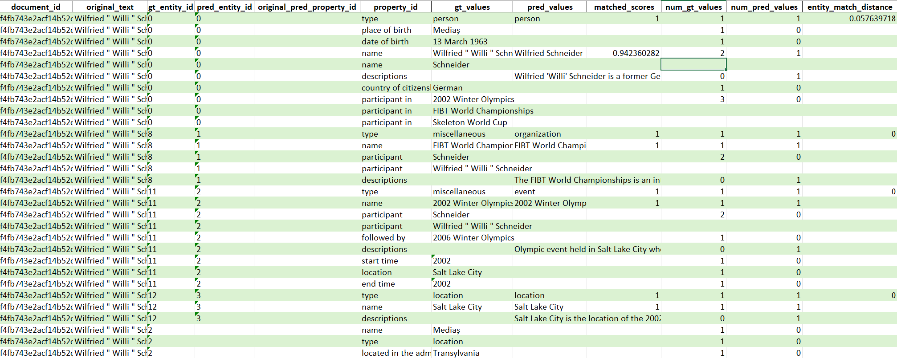
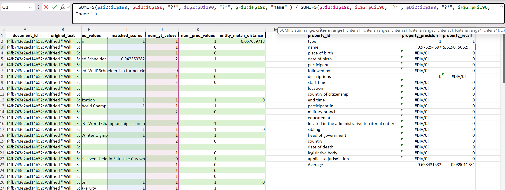

# Entity extraction evaluation example

This directory provides a minimal, runnable example of evaluating entity extraction with MS-KeBAB.

## Folder structure

- `extraction_example.py` – runnable script.
- `tasks.json` – task configuration (points to data + metric config).
- `data/`
  - `redocred_small_extracts.jsonl` – documents / extracts (one JSON object per line) consumed as input.
  - `redocred_small_entities.jsonl` – ground‑truth extracted entities (aligned line‑wise with extracts).
  - `property_schema.json` – property schema used in ground truth
  - `metrics_config.json` – metric configuration (overrides defaults).
  - `predictions.jsonl` – sample model output (for demonstration).

## Quick Start

* install the package (in repo root):

```bash
uv sync
```

* run evaluation (from this directory):

```bash
uv run extraction_example.py \
  --predictions ./data/predictions.jsonl \
  --output_dir ./output_dir
```

This will produce an output directory with:
- `metrics.json` – AESOP metrics - per file and aggregated across dataset
- `debug_output/` directory with debug .xlsx files if specified in `metrics_config.json`.


## Predictions format

Each line is a list of entity fragments for the corresponding line in extracts file

Entity fragment structure:
```json
{
  "entity_id": "<string-id>",
  "properties": {
    "<property_id>": ["<value1>", "<value2>", "..."]
  },
  "source_ids": [], // source IDs that contributed to the entity
  "evidence_map": {} // map from property ID to a list that maps each value index to a list of evidence indices that support it.
}
```

Notes:
- `properties` keys must match `property_id` values in the schema.
- Values are lists (even for singletons).
- Order of entities within a line is not used for scoring (matching is distance-based).

## Property schema structure

```json
{
    "name": "my schema",
    "data_types": [ // datatypes of property values
      {
        "data_type_id": "text",
        "value_type": "Text",
        "description": "text",
        "category_values": []
      },
      {
        "data_type_id": "date",
        "value_type": "Date",
        "description": "date",
        "category_values": []
      }
    ],
    "properties": [ // all property ids in ground truth
      {
        "property_id": "<property_id>",
        "data_type_id": "text",
        "description": "<description>",
        "display_name": "<property_name>",
        "is_collection": true
      },
    ]
}
```

## Metrics configuration file structure

Example:
```json
{
  "aesop": { // use AESOP metric
    "entity_distance": { // settings for entity matching
      "property_to_distance": { // per-property distance function overrides
        "name": {
          "distance_function": { "name": "EmbeddingDistance" },
          "weight": 1 // unnormalised weight for the property in the weighted average
        }
      },
      "default_property_distance": { "name": "TokenDistance" },
      "default_property_weight": 0
    },
    "matching_threshold": 0.5, // matching threshold for entity matching
    "default_property_distance": { "name": "TokenDistance" },
    "property_distance_functions": { // per-property distance function overrides
      "name": { "name": "EmbeddingDistance" },
      "type": { "name": "TypeNameDistance" },
      "descriptions": { "name": "EmbeddingDistance" },
      "definitions": { "name": "EmbeddingDistance" }
    },
    "properties_to_skip": [], // exclude properties from AESOP computation
    "debug_output_dir": "./output_dir/debug_output"  // if present, benchmarking code produces XLSX files with detailed information on how entities and properties were matched and their matching scores
  }
}
```
Notes:

Supported element distance function names (see definitions [here](../../../kebab/tasks/metrics/extraction/aesop/distances.py)):
- `TokenDistance` (Jaccard distance over token ids)
- `EmbeddingDistance` (cosine distance between SentenceTransformer embeddings)
- `EditDistance`
- `BinaryMatchDistance`
- `TypeNameDistance` (like binary match, but matches `miscellaneous` type to any type;specific to ReDocRED)

All produced distances are in [0,1] (lower = closer).

## Debug output structure

For each document in the dataset evaluation produces a debug info file with filename "<document_id>_debug_info.xlsx" with document-level metrics and file "debug_info.xlsx" for the whole dataset. It contains debug information for all the files and dataset-level metrics.



Each row in debug info file contains detailed information on whether a particular value in prediction was matched to ground truth and what was the matching score. Also, for each property number of predicted values in ground truth and prediction is recorded for metrics computation. Entity matching scores are given for debugging purposes and not used in metric computation.



To the right of the property-level debug information there are per-property precision and recall metrics calculated using excel formulas for readability.

## Adding a New Extraction Task

1. Prepare `extracts.jsonl` (one document per line).
2. Prepare aligned `ground_truth_entities.jsonl` (each line: JSON array of entity objects).
3. Create / adapt a `property_schema.json` for your ground truth entities.
4. Create a metric config JSON.
5. Add an entry in a `tasks.json` file:
```json
{
  "MyTask": {
    "task": "Extraction",
    "data": {
      "extracts": "path/to/extracts.jsonl",
      "schema": "path/to/property_schema.json",
      "ground_truth": "path/to/ground_truth_entities.jsonl",
      "metrics_config": "path/to/metrics_config.json"
    }
  }
}
```
